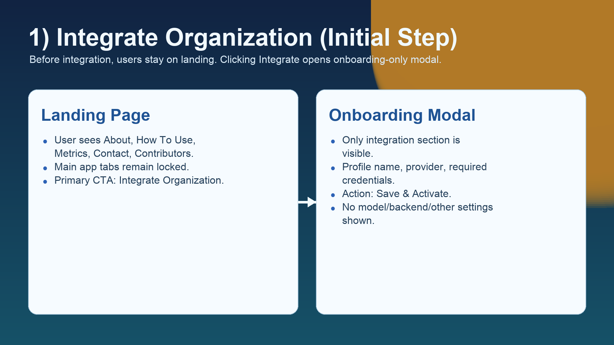
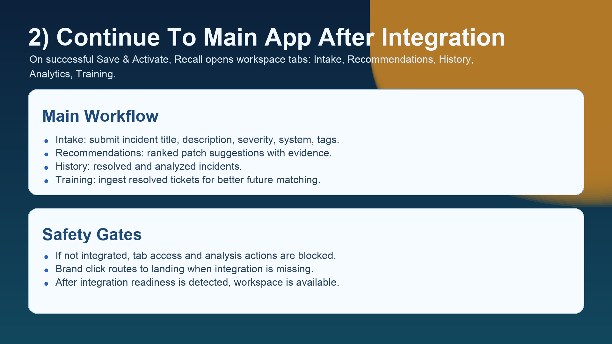
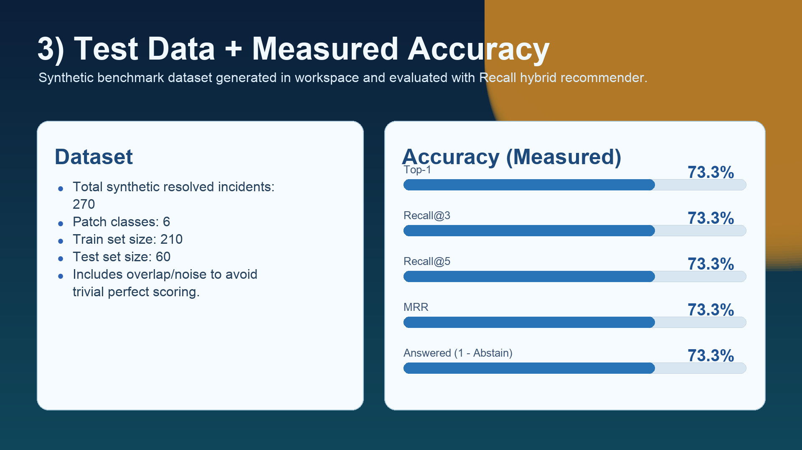
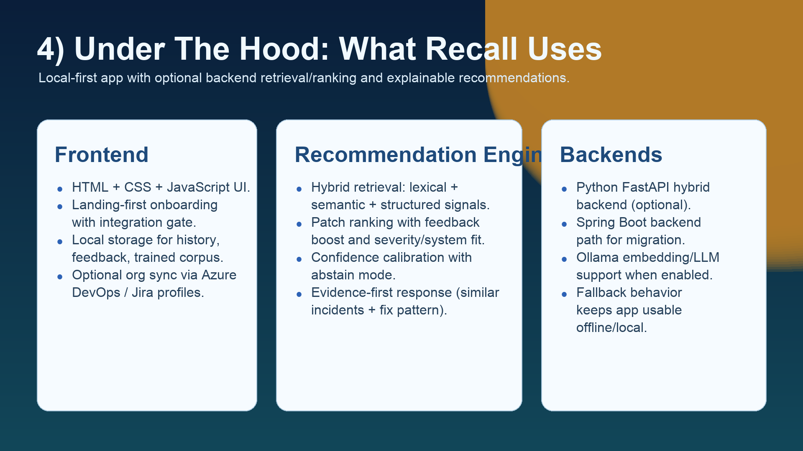

# Recall

Recall is an on-call incident resolution workspace that helps engineers find previously solved incidents and reuse code-backed fixes faster.

> Built with &#10084; using Claude + Codex.

## What We Are Trying To Build

We are building a practical incident assistant for engineering teams under pressure:

- Ingest resolved incidents from organization tools (Azure DevOps / Jira)
- Learn from historical fixes and code-change patterns
- Rank likely resolutions for new incidents
- Show evidence so engineers can trust recommendations
- Improve quality continuously using feedback

## Contributors

- **kushalsharma1218** — Founder, product owner, and core builder
- **Claude** — AI build partner (ideation, iteration quality, engineering direction)
- **Codex (GPT-5)** — Implementation partner (architecture, coding, and technical reviews)

## Why Recall

On-call teams repeatedly solve similar production problems. Valuable fix context often exists in old tasks/PRs but is difficult to find quickly. Recall reduces that search and triage time by turning prior resolutions into an operational recommendation workflow.

## How We Are Building It

1. Integration-first onboarding:
- User lands on Recall first
- Main workspace unlocks only after org integration is configured

2. Local-first product UX:
- Fast browser-first workflow for intake, recommendations, history, analytics, training
- Smooth fallback behavior when backend is unavailable

3. Java backend direction:
- Spring Boot backend is the active backend path
- Stable API contract consumed by frontend
- Recommendation logic includes scoring, confidence handling, and abstain behavior

## What We Are Using

| Layer | Tech |
|---|---|
| Frontend | HTML, CSS, Vanilla JavaScript, Chart.js |
| Backend | Java 17, Spring Boot 3.3.x, Maven |
| Integrations | Azure DevOps, Jira |
| Local state | `localStorage` (history, training, feedback) |
| API | `/health`, `/v1/recommend`, `/v1/feedback`, `/v1/reload` |

## Repository Scope

- Included in git: frontend + `spring-backend` (Java)
- Legacy Python backend is intentionally not tracked in this repository

## Current Product Flow

1. Open landing page (`Recall`)
2. Click `Integrate Organization`
3. Configure provider + credentials and `Save & Activate`
4. Main workspace opens:
- Intake
- Recommendations
- History
- Analytics
- Training
5. Submit incident and review ranked fix suggestions with evidence

## Under The Hood (Recommendation Engine)

- Query normalization from title/description/severity/system/tags
- Candidate retrieval across resolved incident corpus
- Scoring using lexical + signal overlap + context features
- Confidence gating with abstain when evidence is weak
- Feedback-aware ranking improvements over time

For backend details, see [spring-backend/README.md](spring-backend/README.md).

## Demo Screenshots

### Integration-first onboarding


### Main workflow after integration


### Measured demo accuracy snapshot


### Under-the-hood architecture


## Demo Video

- Walkthrough video: [artifacts/demo_video/recall_walkthrough.mp4](artifacts/demo_video/recall_walkthrough.mp4)
- Voiceover script: [artifacts/demo_video/voiceover_script.md](artifacts/demo_video/voiceover_script.md)
- Demo artifact summary: [artifacts/demo_video/demo_summary.json](artifacts/demo_video/demo_summary.json)

## Demo Benchmark Snapshot

From the included demo run:

| Metric | Value |
|---|---|
| Top-1 | 73.3% |
| Recall@3 | 73.3% |
| Recall@5 | 73.3% |
| MRR | 73.3% |
| Abstain Rate | 26.7% |
| Test Size | 60 |

## Run Locally

### 1) Frontend

From project root:

```bash
npx http-server . -p 4173
```

Open:

- `http://127.0.0.1:4173`

### 2) Java backend

```bash
cd spring-backend
mvn spring-boot:run
```

Default backend URL:

- `http://127.0.0.1:8080`

In UI settings, set backend URL to that address and enable backend recommendations.
