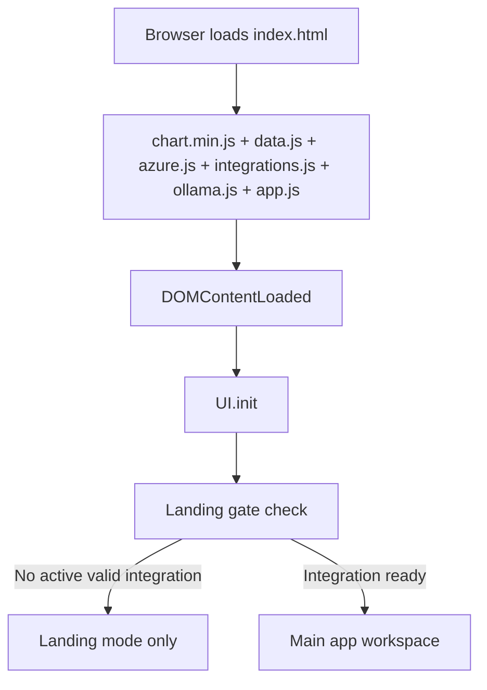
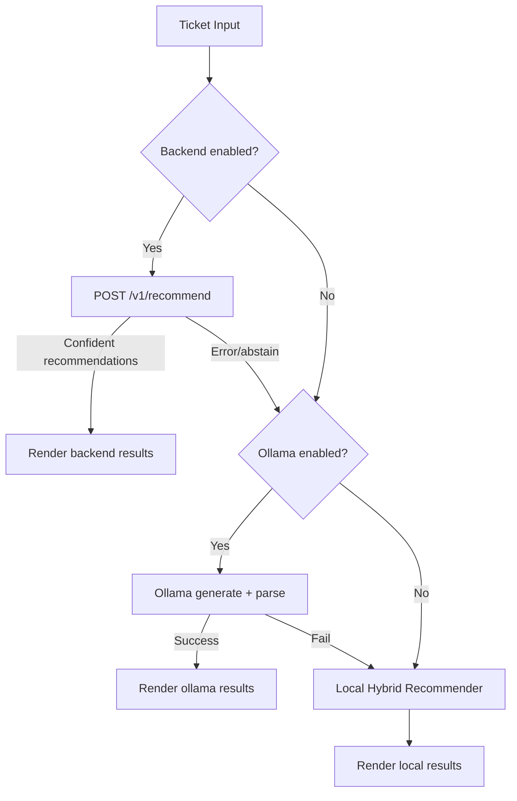

# Recall Full Technical Deep Dive

## 1. Purpose and Scope

This document is a full-system engineering walkthrough of Recall.
It explains:

- every major file and module
- runtime execution order
- recommendation logic (BM25, TF-IDF, signal overlap, confidence/abstain)
- training flows (single ticket + bulk code training)
- embeddings and LLM usage (Ollama)
- Spring backend strategy/fallback/circuit behavior
- storage model and safety constraints

Note on “every line”: the codebase has ~12,631 lines across frontend + backend (+ optional legacy backend workspace files).
This guide is **function-by-function and flow-by-flow** with line references, which is the practical way to explain every executable unit clearly.

## 2. Repository Structure (What each file is for)

### Root frontend/runtime

- `index.html`: main product shell with landing + gated app workspace + settings modal.
- `app.js`: primary frontend runtime controller and local recommendation engine.
- `data.js`: in-memory constants (`PATCH_LIBRARY`, `HISTORICAL_TICKETS`, severity/system enums).
- `azure.js`: Azure DevOps integration service (read-heavy, safe-by-default).
- `integrations.js`: profile manager + provider abstraction (Azure + Jira).
- `ollama.js`: local LLM + embedding integration over Ollama.
- `style.css`: all UI styles (base + many override/theme sections).
- `about.html`, `contact.html`, `contributors.html`: standalone information pages (legacy/static route style).
- `chart.min.js`: local Chart.js bundle (no CDN dependency).

### Java backend (active backend path)

- `spring-backend/src/main/java/...`: Spring Boot app, API, strategy gateways, local recommender.
- `spring-backend/src/test/java/...`: recommender and circuit breaker tests.
- `spring-backend/src/main/resources/application.yml`: backend mode + timeouts + CORS patterns.

### Optional/legacy workspace components (not active tracked backend path)

- `backend/`: Python hybrid recommender workspace (FastAPI/scripts/data pipeline) still present in local workspace.
- `scripts/create_recall_demo_video.py`: artifact generator for demo video/slides.
- `artifacts/demo_video/*`: generated demo assets.

## 3. End-to-End Runtime Execution



### 3.1 Boot sequence (`app.js`)

- `document.addEventListener('DOMContentLoaded', ...)` (`app.js:4124`) is the root startup.
- Calls `UI.init()` (`app.js:1205`) which wires all screens.
- Hydrates trained patches from `TrainingStore` into `PATCH_LIBRARY` (`app.js:4127-4158`).
- Registers modal controls, engine tests, keyboard shortcuts (`app.js:4167-4197`).

### 3.2 Main ticket analysis execution order

When user analyzes a ticket (`_analyzeTicket`, `app.js:2169`) or imports and analyzes (`_fetchAndAnalyze`, `app.js:1984`):

1. Validate/gather ticket payload.
2. Try backend API if enabled (`_runBackendAnalysis`, `app.js:2252`).
3. If backend abstains/fails, try Ollama (`ollama.js` via `OllamaService.recommend`).
4. If Ollama fails or not enabled, fallback to local hybrid engine (`_runTFIDFAnalysis`, `app.js:2299`).
5. Render cards + similar incidents + debug info + feedback controls.



## 4. Frontend Deep Dive

## 4.1 `data.js`

- `PATCH_LIBRARY` starts empty (`data.js:7`) and is populated by training.
- `HISTORICAL_TICKETS` is empty (`data.js:9`), so model quality depends on imported/trained data.
- Severity and DB enums drive UI and normalization (`data.js:12-32`).

## 4.2 `app.js` (core orchestrator)

### 4.2.1 NLP and math primitives (`app.js:11-260`)

- Stopwords + phrase canonicalization + token canonical map.
- `tokenize` pipeline: normalize phrase -> strip chars -> split -> canonicalize -> filter stopwords.
- Implements:
  - lexical overlap score
  - IDF, TF, TF-IDF vector
  - BM25 scoring
  - cosine similarity
- Utility safe localStorage setters/removers.

### 4.2.2 Stores and corpus assembly

- `FeedbackStore` (`app.js:265-339`): per-org feedback boost + ticket history.
- `TrainingStore` (`app.js:344-382`): local training corpus with dedupe by ID/signature.
- `getRecommendationCorpus` (`app.js:384`): merges `HISTORICAL_TICKETS + imported + training`, normalizes, dedupes.
- `RecommendationSettings` (`app.js:403-429`): runtime flags for debug/backend URL/topK.

### 4.2.3 Backend bridge from UI (`BackendRecommendationService`, `app.js:430-640`)

- Builds local corpus payload for backend requests (`_buildLocalCorpus`).
- Calls `/health`, `/v1/recommend`, `/v1/feedback`.
- Re-maps backend `patchId` to local `PATCH_LIBRARY` patch objects.
- Applies local feedback multiplier on top of backend confidence.

### 4.2.4 Local hybrid recommendation engine (`PatchRecommender`, `app.js:646-980`)

#### Candidate scoring

For each corpus ticket:

- Weighted token profile: title x3, desc x2, tags x3, resolution x2, code x2.
- Features:
  - normalized BM25
  - TF-IDF cosine
  - lexical overlap
  - shared high-signal tokens (error-code-like, deadlock/timeout/oom)
- Context multipliers:
  - severity match boost
  - system match boost
  - resolved/source boosts

#### Patch aggregation

- Groups top similar tickets by `resolvedPatch`.
- Computes per-patch support + signal/severity/system evidence + feedback multiplier.
- Computes final score and confidence.
- Produces human-readable reasoning string.
- Applies abstain if evidence is weak or ambiguous.

### 4.2.5 Analytics + charts

- `Analytics` (`app.js:985-1050`): success rates, severity/system distribution, resolution summary.
- `ChartManager` (`app.js:1055-1191`): four chart renderers (usage, severity, systems, success).

### 4.2.6 UI controller (`UI`, `app.js:1196-3922`)

Major responsibilities:

- startup wiring, tabs, forms, stats, charts
- landing-mode gate until integration is valid
- integration profile CRUD/sync actions
- intake analyze paths (manual + fetch-and-analyze)
- results rendering and feedback submission
- history rendering and reload
- training workflows (single + bulk)

Important behaviors:

- Navigation and tab actions are blocked until integration readiness (`_requireIntegrationReady`).
- `Fetch and Analyze` pipeline auto-fills fields from Azure work item, then runs engine fallback chain.
- `Factory Reset` clears all app-owned localStorage keys and runtime state.

### 4.2.7 Training subsystem in `UI`

Single ticket train (`_fetchTrainTicket` + `_addToTraining`):

- Fetches work item.
- Detects linked PRs and prefers completed PR.
- Pulls PR changed files and extracts DB/code content where possible.
- Creates a dynamic trained patch in `PATCH_LIBRARY`.
- Stores aligned training ticket in `TrainingStore`.

Bulk train (`_bulkTrainByCreators`):

- Fetches resolved **Task** work items filtered by creator emails.
- For each task:
  - find completed PR
  - fetch changed code files
  - pull commit content snippets
  - create patch-ticket mapping
- Tracks skip reasons with summarization.
- Purges old non-code training entries before/while retraining.

### 4.2.8 Settings controller (`SettingsModal`, `app.js:3927-4088`)

- Modal mode: `full` vs `onboarding`.
- Saves runtime engine options.
- Tests Ollama and backend connectivity.
- Updates engine indicator.

### 4.2.9 Boot and hydration (`app.js:4124-4197`)

- `UI.init()`
- patch library hydration from saved training
- global object exports for inline handlers
- event listeners for modal + shortcuts.

## 4.3 `ollama.js` (local semantic + LLM reasoning)

### Settings and connectivity

- Persists `enabled/model/embeddingModel/temperature/lastStatus`.
- `checkConnection` probes `GET /api/tags`.

### Embedding flow

- `_embedText` first tries `/api/embed`, then fallback `/api/embeddings` for older Ollama.
- Uses in-memory LRU-like cache (`Map` capped by `_embeddingCacheLimit`).
- Similar incident retrieval:
  - lexical pre-candidates from local recommender
  - embedding cosine rerank
  - top-N similar incidents returned.

### LLM prompt and parsing

- `_buildPrompt` explicitly injects top similar resolved incidents with:
  - ticket title
  - resolution text
  - patch applied
- asks model to return strict JSON array of patch recommendations.
- `_parseRecommendations` strips fences, rescues malformed JSON edges, validates patch IDs, applies feedback boost ordering.

## 4.4 `azure.js` (Azure DevOps service)

Key points:

- Read-only ticket safety default: `READ_ONLY_TICKETS = true`.
- Org/profile storage is sanitized (PAT and secrets are removed from persistent storage).
- Supports:
  - connection test via WIQL
  - bulk fetch work items with optional creator-email filtering
  - single work item fetch with relations/comments
  - PR details/iterations/changes
  - file content fetch at commit
- Work item normalization maps ADO severity/priority into app severity.
- `postComment` exists but blocked unless write mode explicitly enabled.

## 4.5 `integrations.js` (multi-provider profile manager)

Provider abstraction:

- `azure` provider uses `AzureDevOpsService`.
- `jira` provider uses `JiraService`.

Profile and secret handling:

- profile metadata/config in `localStorage`.
- secret/password fields in `sessionStorage` only.
- URL and config validation enforces HTTPS and domain constraints:
  - Azure: `dev.azure.com` or `<org>.visualstudio.com`
  - Jira Cloud: `.atlassian.net`

Sync flow:

- fetch resolved tickets from provider
- normalize to app ticket format
- guess mapped patch via lexical heuristics
- persist imported tickets per profile

## 4.6 `index.html` (DOM contract used by `app.js`)

- Contains both:
  - landing experience (`#org-onboarding-panel`) and
  - full app workspace (`.app-wrapper`).
- App behavior toggles `body.landing-active` to gate access.
- Defines all IDs used by controller for:
  - tabs
  - forms
  - settings modal
  - charts
  - training controls

## 4.7 `style.css` (visual system)

Observations:

- Imports Google Fonts (`JetBrains Mono`, `Plus Jakarta Sans`, `Space Grotesk`).
- Contains base styles plus many later override blocks/themes.
- Final visuals are determined by CSS cascade order, so later declarations override earlier ones.
- Includes dedicated style blocks for:
  - landing page
  - quick settings menu
  - training/code snippet cards
  - info pages
  - responsive breakpoints.

## 5. Spring Backend Deep Dive (`spring-backend`)

## 5.1 API surface

- `GET /health`
- `POST /v1/recommend`
- `POST /v1/feedback`
- `POST /v1/reload`

`RecommenderController` is a thin delegator to `RecommenderService`.

## 5.2 Strategy + fallback architecture

- `RecommendationGateway` interface.
- `LocalRecommendationGateway` delegates to `LocalFallbackRecommender`.
- `ProxyRecommendationGateway` delegates to `LegacyBackendClient`.
- `RecommenderService` chooses behavior by mode + circuit + fallback flag.

Modes:

- `LOCAL`: always local recommender.
- `PROXY`: try legacy backend first, fallback to local on failure if enabled.

## 5.3 Circuit breaker (`LegacyCircuitBreaker`)

- Tracks consecutive proxy failures.
- Opens circuit once threshold is reached.
- Blocks requests until cooldown elapses.
- Success resets failure count and closes circuit.

## 5.4 Local recommender algorithm (`LocalFallbackRecommender`)

This is the main backend recommendation implementation.

### Inputs

- `query` ticket
- patch library list
- local corpus (resolved incidents)

### Pipeline

1. Build incident docs from local corpus.
2. Tokenize weighted text representation.
3. Build TF, DF, IDF, TF-IDF vectors.
4. Compute per-doc features:
   - BM25
   - cosine
   - lexical overlap
   - structured signal overlap (error codes, engine, exception)
5. Normalize and combine lexical + signal + RRF.
6. Select top matches using dynamic floor.
7. Group by `resolvedPatch` and compute patch-level scores.
8. Apply feedback multiplier.
9. Compute confidence and reasoning/evidence.
10. Apply abstain logic on weak/ambiguous evidence.

### Structured signals extracted

- error codes (`error/msg/code NNN...`)
- SQL states (5-digit)
- detected exception class (deadlock/timeout/oom/corruption/login/replication/throttle)
- normalized DB engine
- severity

### Confidence + abstain

Abstains when:

- no recommendations
- top score/confidence/evidence is weak
- top two candidates are too close and low-confidence

## 5.5 Supporting backend classes

- `BackendProperties`: typed config (mode/timeouts/circuit/CORS origins).
- `RestClientConfig`: request/read timeout wiring for `RestTemplate`.
- `CorsConfig`: allowed origin patterns from config.
- `ApiExceptionHandler`: central validation/runtime error payload formatting.
- model classes: request/response payload DTOs.

## 6. Recommendation and Training Algorithms (Detailed)

### 6.1 Local frontend ranking formula (conceptual)

For candidate ticket `d` and query `q`:

- `base = 0.50*bm25_norm + 0.34*cosine + 0.16*overlap`
- multiply by shared-signal boost
- multiply by severity/system context boosts
- patch-level final score multiplies support/signal/feedback boosts

Confidence is then derived from weighted evidence and clipped to range.

### 6.2 Backend local ranking formula (conceptual)

Doc score combines:

- normalized lexical score
- signal score
- RRF score

Patch score combines:

- avg similarity
- support boost
- signal/severity/system/error boosts
- feedback multiplier

### 6.3 Embeddings path

Active in frontend Ollama flow:

- query embedding and candidate incident embeddings via Ollama embedding model (`nomic-embed-text` default)
- cosine similarity for semantic rerank
- top similar incidents injected into generation prompt

### 6.4 Training data evolution

- Initial seed data removed (`PATCH_LIBRARY`/`HISTORICAL_TICKETS` empty in `data.js`).
- Quality depends on:
  - imported resolved incidents
  - manually/bulk trained code-linked incidents
  - feedback votes.

## 7. Storage Model and Data Keys

### `localStorage`

- `azpatch_training_corpus`
- `az_recommendation_settings`
- `az_ollama_settings`
- `azpatch_ticket_integrations`
- `azpatch_ticket_active_profile`
- `azpatch_ticket_imported_<profileId>`
- `azpatch_org_<namespace>_feedback`
- `azpatch_org_<namespace>_history`
- additional per-org integration caches from `azure.js`

### `sessionStorage` (secrets)

- `azpatch_ticket_secret_<profileId>_<field>` for PAT/API token/password fields.

## 8. Safety and Reliability Design

- Integration/credential validation before remote calls.
- Read-only Azure mode default (`READ_ONLY_TICKETS=true`).
- Secrets do not persist across browser restart.
- Multi-engine fallback chain prevents hard downtime.
- Circuit breaker prevents repeated proxy failures.
- Abstain behavior prevents overconfident wrong suggestions.

## 9. Test Coverage Snapshot

- `LocalFallbackRecommenderTest`
  - verifies correct patch is preferred on similar evidence.
  - verifies abstain when no mapped patch evidence exists.
- `RecommenderServiceTest`
  - verifies proxy failure fallback behavior.
  - verifies circuit-open + fallback-disabled throws.
- `LegacyCircuitBreakerTest`
  - verifies open/close state transitions.

## 10. Optional Legacy Python Workspace (present locally)

`backend/` still contains a full Python hybrid recommender workspace:

- FastAPI service
- retrieval/signals/embedding modules
- data scripts for ADO fetch, signal extraction, embedding build, split/eval/rerank

Current product direction in this repo is Java backend (`spring-backend`) + frontend.
Python workspace remains useful as reference tooling and demo artifact generator input.

## 11. Execution Flow Reference by User Journey

### Landing and onboarding

1. Open app.
2. If no active valid integration profile, landing mode stays enabled.
3. `Integrate Organization` opens onboarding modal mode.
4. Save and activate profile unlocks workspace.

### Incident resolution flow

1. Intake manually or fetch from Azure by work item ID/URL.
2. Run recommendation pipeline (backend -> ollama -> local).
3. Show ranked patches + evidence.
4. Mark resolved / feedback to improve ranking.

### Training flow

1. Fetch resolved ticket + PR context.
2. Build trained patch (prefer code snippets where available).
3. Add ticket-to-patch mapping into corpus.
4. Bulk mode repeats same logic for creator-email filtered task set.

## 12. Frontend Function Index (line-level)

```text
app.js:37:const NLP_TOKEN_CANONICAL = {
app.js:61:function normalizeTextForNlp(text) {
app.js:69:function normalizeToken(token) {
app.js:84:function tokenize(text) {
app.js:92:function repeatTokens(tokens, weight) {
app.js:99:function clamp(value, min, max) {
app.js:103:function normalizeSeverityValue(severity) {
app.js:109:function normalizeSystemValue(system) {
app.js:125:function normalizeTagArray(tags) {
app.js:140:function normalizeTicketForModel(rawTicket) {
app.js:165:function ticketContentSignature(ticket) {
app.js:171:function lexicalOverlap(setA, setB) {
app.js:178:function buildIDF(tokenDocs) {
app.js:193:function buildTermFrequency(tokens) {
app.js:199:function bm25Score(queryTokens, docTf, docLen, docFreq, totalDocs, avgDocLen, k1 = 1.5, b = 0.75) {
app.js:217:function buildTFVector(tokens, idfMap = null) {
app.js:228:function cosineSimilarity(vecA, vecB) {
app.js:244:function safeSetLocalStorage(key, value) {
app.js:253:function safeRemoveLocalStorage(key) {
app.js:265:const FeedbackStore = {
app.js:268:    _key(suffix) { return `azpatch_org_${this._namespace}_${suffix}`; },
app.js:271:    setOrgNamespace(orgId) {
app.js:275:    _read() {
app.js:279:    _save(data) { return safeSetLocalStorage(this._key('feedback'), JSON.stringify(data)); },
app.js:281:    getBoost(patchId) {
app.js:286:    recordFeedback(patchId, isPositive) {
app.js:300:    getStats(patchId) {
app.js:305:    getAllStats() { return this._read(); },
app.js:308:    saveTicket(ticket) {
app.js:315:    getHistory() {
app.js:320:    updateTicket(ticketId, updater) {
app.js:335:    clearAll() {
app.js:344:const TrainingStore = {
app.js:347:    getAll() {
app.js:353:    add(ticket) {
app.js:369:    remove(id) {
app.js:375:    clear() {
app.js:379:    count() {
app.js:384:function getRecommendationCorpus() {
app.js:403:const RecommendationSettings = {
app.js:412:    get() {
app.js:420:    save(patch) {
app.js:425:    isDebugEnabled() {
app.js:430:const BackendRecommendationService = {
app.js:433:    _normalizeBaseUrl(url) {
app.js:437:    getConfig() {
app.js:447:    isEnabled() {
app.js:451:    _buildLocalCorpus(ticket, limit = 180) {
app.js:485:    async healthCheck(overrideUrl = '') {
app.js:502:    async recommend(ticket, patches, options = {}) {
app.js:625:    async recordFeedback(patchId, vote) {
app.js:646:const PatchRecommender = {
app.js:648:    _buildWeightedTokens(ticket) {
app.js:671:    _buildCorpusModel() {
app.js:718:    _buildInputFeatures(inputText, severity, system, idf) {
app.js:734:    _sharedSignalCount(querySet, ticketSet) {
app.js:745:    _scoreTickets(inputText, severity, system) {
app.js:799:    _feedbackFactor(patchId) {
app.js:816:    _buildReasoning(data, querySeverityNorm, querySystemNorm) {
app.js:840:    recommend(inputText, severity, system, topN = 5, options = {}) {
app.js:964:    findSimilarResolvedTickets(inputText, severity, system, topN = 5) {
app.js:985:const Analytics = {
app.js:986:    getPatchSuccessRates() {
app.js:1013:    getSeverityDistribution() {
app.js:1021:    getSystemDistribution() {
app.js:1031:    getTopPatches(n = 5) {
app.js:1038:    getResolutionTimeSummary() {
app.js:1055:const ChartManager = {
app.js:1058:    destroy(id) {
app.js:1065:    renderPatchUsageChart(canvasId) {
app.js:1104:    renderSeverityChart(canvasId) {
app.js:1131:    renderSystemChart(canvasId) {
app.js:1161:    renderSuccessRateChart(canvasId) {
app.js:1196:const UI = {
app.js:1205:    init() {
app.js:1223:    _bindWelcomeHero() {
app.js:1232:    _bindBrandHomeRoute() {
app.js:1251:    _isActiveIntegrationReady() {
app.js:1261:    _syncLandingMode() {
app.js:1267:    _requireIntegrationReady(openSettings = false) {
app.js:1274:    _enterWorkspaceAfterIntegration() {
app.js:1280:    _baseModelChoices() {
app.js:1291:    _hostFromUrl(rawUrl = '') {
app.js:1301:    _renderQuickRuntimeDetails(opts = {}) {
app.js:1339:    _syncModelSelectors(selectedModel = '', runtimeModels = []) {
app.js:1369:    _applyModelSelection(model, opts = {}) {
app.js:1381:    _renderQuickAccountDetails() {
app.js:1418:    _openQuickSettingsMenu() {
app.js:1430:    _closeQuickSettingsMenu() {
app.js:1439:    _toggleQuickSettingsMenu() {
app.js:1444:    _initQuickSettingsMenu() {
app.js:1494:    _initOllamaState() {
app.js:1515:    _initIntegrations() {
app.js:1555:    _populateIntegrationProviders() {
app.js:1565:    _renderIntegrationFields(providerId, values = {}) {
app.js:1591:    _collectIntegrationDraft() {
app.js:1620:    _setIntegrationStatus(message, kind = 'info') {
app.js:1633:    _refreshIntegrationSettings() {
app.js:1669:    _renderIntegrationProfiles() {
app.js:1708:    _loadIntegrationProfile(profileId) {
app.js:1722:    _saveIntegrationProfile() {
app.js:1747:    async _testIntegrationProfile() {
app.js:1767:    async _syncIntegrationProfile(profileId = null) {
app.js:1793:    _handleIntegrationListAction(action, profileId) {
app.js:1830:    _updateTicketSourceIndicator() {
app.js:1854:    _populateSystemSelect() {
app.js:1863:    _bindNavigation() {
app.js:1873:    _switchTab(tab) {
app.js:1897:    _bindForm() {
app.js:1951:    _bindAdoFetch() {
app.js:1966:    _populateSubmitProfileSelect() {
app.js:1984:    async _fetchAndAnalyze() {
app.js:2133:    _bindSearch() {
app.js:2139:    _clearValidation() {
app.js:2144:    _validate() {
app.js:2169:    async _analyzeTicket() {
app.js:2252:    async _runBackendAnalysis(ticket, btn = null) {
app.js:2299:    _runTFIDFAnalysis(ticket, btn) {
app.js:2329:    _updateAnalyzeBtnLabel(label) {
app.js:2339:    _isRecommendationDebugEnabled() {
app.js:2343:    _enrichOllamaRecommendationsForDebug(recommendations) {
app.js:2364:    _formatDebugNumber(value, digits = 3) {
app.js:2370:    _renderRecommendationDebug(debug) {
app.js:2422:    _renderResults(ticket, recommendations, engine = 'tfidf', similarIncidents = []) {
app.js:2565:    _renderPatchCard(rec, idx, ticketId, engine = 'tfidf') {
app.js:2699:    _submitFeedback(patchId, isPositive, cardEl) {
app.js:2714:    _markResolved(btn) {
app.js:2738:    _clearHistoryOnly() {
app.js:2748:    _factoryResetAllData() {
app.js:2817:    _renderHistory(searchQuery = '') {
app.js:2863:    _viewHistoryTicket(ticketId) {
app.js:2881:    _renderStats() {
app.js:2908:    _animateCount(el, target) {
app.js:2923:    _renderCharts() {
app.js:2930:    _setupThemeParticles() {
app.js:2967:    _showToast(message, type = 'info') {
app.js:2987:    _escapeHtml(str) {
app.js:2996:    _escapeJsString(str) {
app.js:3012:    _initTrainTab() {
app.js:3038:    _removePatchById(patchId) {
app.js:3044:    _removeTrainingTicket(ticketKey) {
app.js:3058:    _populateTrainProfileSelect() {
app.js:3076:    _parseCreatorEmails(raw) {
app.js:3085:    _isLikelyCodeFile(path) {
app.js:3135:    _summarizeBulkCodeSkipReasons(reasonCounts = {}) {
app.js:3160:    _purgeNonCodeTrainingEntries() {
app.js:3177:    async _resolveCompletedPrForWorkItem(org, item) {
app.js:3207:    async _extractPrCodeSnippets(org, repoId, prId) {
app.js:3248:    async _trainOneResolvedItemWithCode(item, org) {
app.js:3371:    async _bulkTrainByCreators() {
app.js:3473:    async _fetchTrainTicket() {
app.js:3726:    _addToTraining() {
app.js:3862:    _guessSystemFromText(text) {
app.js:3880:    _renderTrainedList() {
app.js:3927:const SettingsModal = {
app.js:3933:    _applyMode(mode = 'full') {
app.js:3951:    open(mode = 'full') {
app.js:3977:    close() {
app.js:3982:    save() {
app.js:4010:    async testConnection() {
app.js:4048:    async testBackendConnection() {
app.js:4093:    _updateEngineIndicator(enabled, status, backendEnabled = false, backendStatus = 'unknown') {
ollama.js:9:const OllamaService = {
ollama.js:28:    getSettings() {
ollama.js:35:    saveSettings(patch) {
ollama.js:43:    isEnabled() {
ollama.js:47:    _textForEmbedding(ticket) {
ollama.js:57:    _resolutionText(ticket) {
ollama.js:63:    _promptSafe(text, maxLen = 260) {
ollama.js:70:    _vectorCosine(a, b) {
ollama.js:84:    _cacheEmbedding(key, vec) {
ollama.js:93:    async _embedText(text, model) {
ollama.js:143:    _lexicalCandidateIncidents(ticket) {
ollama.js:158:    async _findSimilarResolvedByEmbedding(ticket, limit = 3) {
ollama.js:192:    async checkConnection() {
ollama.js:216:    _buildPrompt(ticket, patches, topMatches = []) {
ollama.js:274:    async recommend(ticket, patches) {
ollama.js:322:    _parseRecommendations(rawText, patches, similarIncidents = []) {
ollama.js:378:    async modelExists(modelName) {
integrations.js:8:const JiraService = {
integrations.js:10:    _authHeader(email, apiToken) {
integrations.js:14:    _baseUrl(site) {
integrations.js:18:    async testConnection(config) {
integrations.js:56:    async fetchResolvedIssues(config, options = {}) {
integrations.js:103:    _normalizeIssue(issue, site, projectKey) {
integrations.js:129:    _extractADFText(adfNode) {
integrations.js:151:const TicketIntegrations = {
integrations.js:218:    _parseUrl(value, label) {
integrations.js:236:    _validateAndNormalizeConfig(providerId, config = {}) {
integrations.js:307:    _profileKey(profileId) {
integrations.js:311:    _safeParse(raw, fallback) {
integrations.js:316:    _safeSetLocal(key, value) {
integrations.js:325:    _safeRemoveLocal(key) {
integrations.js:334:    _safeGetSession(key) {
integrations.js:339:    _safeSetSession(key, value) {
integrations.js:348:    _safeRemoveSession(key) {
integrations.js:357:    _secretKey(profileId, fieldKey) {
integrations.js:361:    _secretFields(providerId) {
integrations.js:368:    _extractConfig(providerId, config = {}) {
integrations.js:384:    _storeSecrets(profileId, providerId, secrets = {}) {
integrations.js:397:    _hydrateConfig(profile) {
integrations.js:406:    _sanitizePersistedProfiles(profiles) {
integrations.js:422:    _slug(str) {
integrations.js:430:    _toTagArray(val) {
integrations.js:439:    _guessPatchId(ticket) {
integrations.js:460:    getProviders() {
integrations.js:464:    getProvider(providerId) {
integrations.js:468:    listProfiles() {
integrations.js:478:    getProfile(profileId) {
integrations.js:484:    saveProfile(profile) {
integrations.js:503:    createOrUpdateProfile(input) {
integrations.js:527:    deleteProfile(profileId) {
integrations.js:540:    setActiveProfile(profileId) {
integrations.js:547:    getActiveProfileId() {
integrations.js:552:    getActiveProfile() {
integrations.js:557:    getImportedTickets(profileId) {
integrations.js:567:    getAllImportedTickets() {
integrations.js:571:    _saveImportedTickets(profileId, tickets) {
integrations.js:575:    async testProfile(input) {
integrations.js:583:    async syncProfile(profileId, options = {}) {
azure.js:9:const AzureDevOpsService = {
azure.js:17:    _safeSetLocal(key, value) {
azure.js:26:    _safeRemoveLocal(key) {
azure.js:36:    _orgKey(orgId, suffix) {
azure.js:40:    _sanitizeOrgForStorage(org) {
azure.js:51:    getAllOrgs() {
azure.js:80:    saveOrg(org) {
azure.js:91:    deleteOrg(orgId) {
azure.js:108:    getActiveOrgId() {
azure.js:113:    getActiveOrg() {
azure.js:119:    setActiveOrg(orgId) {
azure.js:127:    generateOrgId(orgUrl, project) {
azure.js:135:    getOrgData(orgId, key, fallback = null) {
azure.js:142:    setOrgData(orgId, key, value) {
azure.js:147:    _authHeader(pat) {
azure.js:151:    _normalizeEmail(value) {
azure.js:158:    _extractEmails(text) {
azure.js:163:    _identityEmails(identity) {
azure.js:174:    isTicketWriteEnabled() {
azure.js:179:    async testConnection(orgUrl, project, pat) {
azure.js:214:    async fetchWorkItems(org, options = {}) {
azure.js:344:    async getWorkItemById(org, workItemId, options = {}) {
azure.js:401:    _extractPRLinks(relations, org) {
azure.js:427:    async getPullRequestDetails(org, prId) {
azure.js:457:    async getPullRequestChanges(org, repoId, prId) {
azure.js:500:    async getFileContentAtCommit(org, repoId, filePath, commitId) {
azure.js:521:    _normalizePR(pr) {
azure.js:543:    _changeTypeName(type) {
azure.js:557:    _normalizeWorkItem(wi, org) {
azure.js:595:    _stripHtml(html) {
azure.js:609:    async postComment(org, workItemId, commentText) {
azure.js:639:    buildPatchComment(workItemId, recommendations, engineType) {
```

## 13. Java Class/Method Index (line-level)

```text
spring-backend/src/main/java/com/recall/backend/service/RecommenderService.java:19:public class RecommenderService {
spring-backend/src/main/java/com/recall/backend/service/RecommenderService.java:26:    public RecommenderService(
spring-backend/src/main/java/com/recall/backend/service/RecommenderService.java:38:    public Map<String, Object> health() {
spring-backend/src/main/java/com/recall/backend/service/RecommenderService.java:81:    public RecommendResponse recommend(RecommendRequest request) {
spring-backend/src/main/java/com/recall/backend/service/RecommenderService.java:106:    public FeedbackResponse feedback(FeedbackRequest request) {
spring-backend/src/main/java/com/recall/backend/service/RecommenderService.java:136:    public Map<String, Object> reload() {
spring-backend/src/main/java/com/recall/backend/service/RecommenderService.java:173:    private int asInt(Object value, int defaultVal) {
spring-backend/src/main/java/com/recall/backend/service/RecommenderService.java:187:    private boolean asBoolean(Object value, boolean defaultVal) {
spring-backend/src/main/java/com/recall/backend/service/RecommenderService.java:197:    private String safeHost(String rawUrl) {
spring-backend/src/main/java/com/recall/backend/service/RecommenderService.java:206:    private RecommendResponse fallbackRecommend(RecommendRequest request, String reason) {
spring-backend/src/main/java/com/recall/backend/service/LegacyBackendClient.java:22:public class LegacyBackendClient {
spring-backend/src/main/java/com/recall/backend/service/LegacyBackendClient.java:27:    public LegacyBackendClient(RestTemplate restTemplate, BackendProperties properties) {
spring-backend/src/main/java/com/recall/backend/service/LegacyBackendClient.java:32:    public Map<String, Object> health() {
spring-backend/src/main/java/com/recall/backend/service/LegacyBackendClient.java:44:    public RecommendResponse recommend(RecommendRequest request) {
spring-backend/src/main/java/com/recall/backend/service/LegacyBackendClient.java:59:    public FeedbackResponse feedback(FeedbackRequest request) {
spring-backend/src/main/java/com/recall/backend/service/LegacyBackendClient.java:74:    public Map<String, Object> reload() {
spring-backend/src/main/java/com/recall/backend/service/LegacyBackendClient.java:86:    private String baseUrl() {
spring-backend/src/main/java/com/recall/backend/RecallBackendApplication.java:10:public class RecallBackendApplication {
spring-backend/src/main/java/com/recall/backend/RecallBackendApplication.java:11:    public static void main(String[] args) {
spring-backend/src/main/java/com/recall/backend/config/RestClientConfig.java:11:public class RestClientConfig {
spring-backend/src/main/java/com/recall/backend/config/RestClientConfig.java:14:    public RestTemplate restTemplate(RestTemplateBuilder builder, BackendProperties properties) {
spring-backend/src/test/java/com/recall/backend/service/LocalFallbackRecommenderTest.java:14:class LocalFallbackRecommenderTest {
spring-backend/src/test/java/com/recall/backend/service/LocalFallbackRecommenderTest.java:16:    private final LocalFallbackRecommender recommender = new LocalFallbackRecommender();
spring-backend/src/main/java/com/recall/backend/service/resilience/LegacyCircuitBreaker.java:12:public class LegacyCircuitBreaker {
spring-backend/src/main/java/com/recall/backend/service/resilience/LegacyCircuitBreaker.java:15:    private final AtomicInteger failures = new AtomicInteger(0);
spring-backend/src/main/java/com/recall/backend/service/resilience/LegacyCircuitBreaker.java:16:    private final AtomicLong openUntilEpochMs = new AtomicLong(0);
spring-backend/src/main/java/com/recall/backend/service/resilience/LegacyCircuitBreaker.java:18:    public LegacyCircuitBreaker(BackendProperties properties) {
spring-backend/src/main/java/com/recall/backend/service/resilience/LegacyCircuitBreaker.java:22:    public boolean allowRequest() {
spring-backend/src/main/java/com/recall/backend/service/resilience/LegacyCircuitBreaker.java:28:    public void recordSuccess() {
spring-backend/src/main/java/com/recall/backend/service/resilience/LegacyCircuitBreaker.java:33:    public void recordFailure() {
spring-backend/src/main/java/com/recall/backend/service/resilience/LegacyCircuitBreaker.java:40:    public boolean isOpen() {
spring-backend/src/main/java/com/recall/backend/service/resilience/LegacyCircuitBreaker.java:44:    public int failureCount() {
spring-backend/src/main/java/com/recall/backend/service/resilience/LegacyCircuitBreaker.java:48:    public long remainingOpenMs() {
spring-backend/src/main/java/com/recall/backend/service/resilience/LegacyCircuitBreaker.java:54:    public Map<String, Object> state() {
spring-backend/src/main/java/com/recall/backend/controller/RecommenderController.java:17:public class RecommenderController {
spring-backend/src/main/java/com/recall/backend/controller/RecommenderController.java:21:    public RecommenderController(RecommenderService recommenderService) {
spring-backend/src/main/java/com/recall/backend/controller/RecommenderController.java:26:    public Map<String, Object> health() {
spring-backend/src/main/java/com/recall/backend/controller/RecommenderController.java:31:    public RecommendResponse recommend(@Valid @RequestBody RecommendRequest request) {
spring-backend/src/main/java/com/recall/backend/controller/RecommenderController.java:36:    public FeedbackResponse feedback(@Valid @RequestBody FeedbackRequest request) {
spring-backend/src/main/java/com/recall/backend/controller/RecommenderController.java:41:    public Map<String, Object> reload() {
spring-backend/src/main/java/com/recall/backend/model/TicketRecord.java:6:public class TicketRecord {
spring-backend/src/test/java/com/recall/backend/service/RecommenderServiceTest.java:19:class RecommenderServiceTest {
spring-backend/src/main/java/com/recall/backend/config/CorsConfig.java:11:public class CorsConfig {
spring-backend/src/main/java/com/recall/backend/config/CorsConfig.java:15:    public CorsConfig(BackendProperties backendProperties) {
spring-backend/src/main/java/com/recall/backend/config/CorsConfig.java:20:    public WebMvcConfigurer webMvcConfigurer() {
spring-backend/src/main/java/com/recall/backend/config/CorsConfig.java:23:            public void addCorsMappings(CorsRegistry registry) {
spring-backend/src/test/java/com/recall/backend/service/resilience/LegacyCircuitBreakerTest.java:8:class LegacyCircuitBreakerTest {
spring-backend/src/main/java/com/recall/backend/controller/ApiExceptionHandler.java:17:public class ApiExceptionHandler {
spring-backend/src/main/java/com/recall/backend/controller/ApiExceptionHandler.java:20:    public ResponseEntity<Map<String, Object>> handleValidation(
spring-backend/src/main/java/com/recall/backend/controller/ApiExceptionHandler.java:38:    public ResponseEntity<Map<String, Object>> handleBadRequest(IllegalArgumentException ex, HttpServletRequest request) {
spring-backend/src/main/java/com/recall/backend/controller/ApiExceptionHandler.java:43:    public ResponseEntity<Map<String, Object>> handleUnavailable(IllegalStateException ex, HttpServletRequest request) {
spring-backend/src/main/java/com/recall/backend/controller/ApiExceptionHandler.java:48:    public ResponseEntity<Map<String, Object>> handleRuntime(RuntimeException ex, HttpServletRequest request) {
spring-backend/src/main/java/com/recall/backend/controller/ApiExceptionHandler.java:52:    private ResponseEntity<Map<String, Object>> error(
spring-backend/src/main/java/com/recall/backend/controller/ApiExceptionHandler.java:67:    private String formatFieldError(FieldError e) {
spring-backend/src/main/java/com/recall/backend/config/BackendProperties.java:13:public class BackendProperties {
spring-backend/src/main/java/com/recall/backend/config/BackendProperties.java:41:    private List<String> allowedOrigins = List.of(
spring-backend/src/main/java/com/recall/backend/config/BackendProperties.java:48:    public Mode getMode() {
spring-backend/src/main/java/com/recall/backend/config/BackendProperties.java:52:    public void setMode(Mode mode) {
spring-backend/src/main/java/com/recall/backend/config/BackendProperties.java:56:    public String getLegacyBaseUrl() {
spring-backend/src/main/java/com/recall/backend/config/BackendProperties.java:60:    public void setLegacyBaseUrl(String legacyBaseUrl) {
spring-backend/src/main/java/com/recall/backend/config/BackendProperties.java:64:    public long getRequestTimeoutMs() {
spring-backend/src/main/java/com/recall/backend/config/BackendProperties.java:68:    public void setRequestTimeoutMs(long requestTimeoutMs) {
spring-backend/src/main/java/com/recall/backend/config/BackendProperties.java:72:    public long getHealthTimeoutMs() {
spring-backend/src/main/java/com/recall/backend/config/BackendProperties.java:76:    public void setHealthTimeoutMs(long healthTimeoutMs) {
spring-backend/src/main/java/com/recall/backend/config/BackendProperties.java:80:    public boolean isFallbackEnabled() {
spring-backend/src/main/java/com/recall/backend/config/BackendProperties.java:84:    public void setFallbackEnabled(boolean fallbackEnabled) {
spring-backend/src/main/java/com/recall/backend/config/BackendProperties.java:88:    public int getLegacyFailureThreshold() {
spring-backend/src/main/java/com/recall/backend/config/BackendProperties.java:92:    public void setLegacyFailureThreshold(int legacyFailureThreshold) {
spring-backend/src/main/java/com/recall/backend/config/BackendProperties.java:96:    public long getLegacyCooldownMs() {
spring-backend/src/main/java/com/recall/backend/config/BackendProperties.java:100:    public void setLegacyCooldownMs(long legacyCooldownMs) {
spring-backend/src/main/java/com/recall/backend/config/BackendProperties.java:104:    public List<String> getAllowedOrigins() {
spring-backend/src/main/java/com/recall/backend/config/BackendProperties.java:108:    public void setAllowedOrigins(List<String> allowedOrigins) {
spring-backend/src/main/java/com/recall/backend/model/FeedbackRequest.java:8:public class FeedbackRequest {
spring-backend/src/main/java/com/recall/backend/model/Recommendation.java:11:public class Recommendation {
spring-backend/src/main/java/com/recall/backend/model/Recommendation.java:16:    public List<String> evidence = new ArrayList<>();
spring-backend/src/main/java/com/recall/backend/model/Recommendation.java:17:    public Map<String, Double> features = new LinkedHashMap<>();
spring-backend/src/main/java/com/recall/backend/service/LocalFallbackRecommender.java:37:public class LocalFallbackRecommender {
spring-backend/src/main/java/com/recall/backend/service/LocalFallbackRecommender.java:39:    private static final Pattern ERROR_CODE_RE = Pattern.compile("\\b(?:error|msg|code)\\s*[:#]?\\s*(\\d{3,6})\\b", Pattern.CASE_INSENSITIVE);
spring-backend/src/main/java/com/recall/backend/service/LocalFallbackRecommender.java:40:    private static final Pattern SQL_STATE_RE = Pattern.compile("\\b(\\d{5})\\b");
spring-backend/src/main/java/com/recall/backend/service/LocalFallbackRecommender.java:41:    private static final Pattern PATCH_ID_RE = Pattern.compile("\\bP\\d{3,6}\\b", Pattern.CASE_INSENSITIVE);
spring-backend/src/main/java/com/recall/backend/service/LocalFallbackRecommender.java:43:    private static final Map<String, Pattern> EXCEPTION_PATTERNS = Map.ofEntries(
spring-backend/src/main/java/com/recall/backend/service/LocalFallbackRecommender.java:53:    private static final Set<String> STOPWORDS = Set.of(
spring-backend/src/main/java/com/recall/backend/service/LocalFallbackRecommender.java:62:    private final ConcurrentHashMap<String, VoteCounter> feedback = new ConcurrentHashMap<>();
spring-backend/src/main/java/com/recall/backend/service/LocalFallbackRecommender.java:64:    public Map<String, Object> health() {
spring-backend/src/main/java/com/recall/backend/service/LocalFallbackRecommender.java:73:    public Map<String, Object> reload() {
spring-backend/src/main/java/com/recall/backend/service/LocalFallbackRecommender.java:81:    public RecommendResponse recommend(RecommendRequest request) {
spring-backend/src/main/java/com/recall/backend/service/LocalFallbackRecommender.java:374:    public FeedbackResponse recordFeedback(String patchId, String vote) {
spring-backend/src/main/java/com/recall/backend/service/LocalFallbackRecommender.java:394:    private List<IncidentDoc> buildDocs(List<TicketRecord> localCorpus) {
spring-backend/src/main/java/com/recall/backend/service/LocalFallbackRecommender.java:451:    private Map<String, Integer> buildDocFreq(List<IncidentDoc> docs) {
spring-backend/src/main/java/com/recall/backend/service/LocalFallbackRecommender.java:461:    private Map<String, Double> buildIdf(Map<String, Integer> df, int totalDocs) {
spring-backend/src/main/java/com/recall/backend/service/LocalFallbackRecommender.java:469:    private Map<String, Integer> termFrequency(List<String> tokens) {
spring-backend/src/main/java/com/recall/backend/service/LocalFallbackRecommender.java:477:    private Map<String, Double> tfidfVec(List<String> tokens, Map<String, Double> idf) {
spring-backend/src/main/java/com/recall/backend/service/LocalFallbackRecommender.java:488:    private double bm25(List<String> queryTokens, Map<String, Integer> docTf, int docLen, Map<String, Integer> docFreq, int totalDocs, double avgDocLen) {
spring-backend/src/main/java/com/recall/backend/service/LocalFallbackRecommender.java:507:    private double cosine(Map<String, Double> a, Map<String, Double> b) {
spring-backend/src/main/java/com/recall/backend/service/LocalFallbackRecommender.java:529:    private double lexicalOverlap(Set<String> a, Set<String> b) {
spring-backend/src/main/java/com/recall/backend/service/LocalFallbackRecommender.java:539:    private Map<String, Double> normalize01(Map<String, Double> values) {
spring-backend/src/main/java/com/recall/backend/service/LocalFallbackRecommender.java:552:    private Map<String, Double> rrf(List<List<String>> rankedLists, int k) {
spring-backend/src/main/java/com/recall/backend/service/LocalFallbackRecommender.java:564:    private double daysSince(String isoDate) {
spring-backend/src/main/java/com/recall/backend/service/LocalFallbackRecommender.java:582:    private FeedbackScore feedbackMultiplier(String patchId) {
spring-backend/src/main/java/com/recall/backend/service/LocalFallbackRecommender.java:597:    private Signals extractSignals(Map<String, Object> source) {
spring-backend/src/main/java/com/recall/backend/service/LocalFallbackRecommender.java:643:    private String detectException(String text) {
spring-backend/src/main/java/com/recall/backend/service/LocalFallbackRecommender.java:652:    private double overlapScore(Signals query, Signals candidate) {
spring-backend/src/main/java/com/recall/backend/service/LocalFallbackRecommender.java:680:    private List<String> weightedTokens(String title, String description, List<String> tags, String resolution, String codeText) {
spring-backend/src/main/java/com/recall/backend/service/LocalFallbackRecommender.java:693:    private List<String> repeat(List<String> tokens, int n) {
spring-backend/src/main/java/com/recall/backend/service/LocalFallbackRecommender.java:702:    private List<String> tokenize(String text) {
spring-backend/src/main/java/com/recall/backend/service/LocalFallbackRecommender.java:717:    private List<String> parseTags(Object raw) {
spring-backend/src/main/java/com/recall/backend/service/LocalFallbackRecommender.java:735:    private String normalizeText(String value) {
spring-backend/src/main/java/com/recall/backend/service/LocalFallbackRecommender.java:748:    private String normalizeToken(String token) {
spring-backend/src/main/java/com/recall/backend/service/LocalFallbackRecommender.java:788:    private String normalizeSeverity(String raw) {
spring-backend/src/main/java/com/recall/backend/service/LocalFallbackRecommender.java:796:    private String normalizeSystem(String raw) {
spring-backend/src/main/java/com/recall/backend/service/LocalFallbackRecommender.java:815:    private String safeTicketId(TicketRecord ticket) {
spring-backend/src/main/java/com/recall/backend/service/LocalFallbackRecommender.java:820:    private String joinTags(Object raw) {
spring-backend/src/main/java/com/recall/backend/service/LocalFallbackRecommender.java:824:    private String safe(String value) {
spring-backend/src/main/java/com/recall/backend/service/LocalFallbackRecommender.java:828:    private String stringVal(Object value) {
spring-backend/src/main/java/com/recall/backend/service/LocalFallbackRecommender.java:832:    private int clampTopK(Integer value) {
spring-backend/src/main/java/com/recall/backend/service/LocalFallbackRecommender.java:838:    private double clamp(double value, double min, double max) {
spring-backend/src/main/java/com/recall/backend/service/LocalFallbackRecommender.java:842:    private double round(double value, int decimals) {
spring-backend/src/main/java/com/recall/backend/service/LocalFallbackRecommender.java:847:    private static final class IncidentDoc {
spring-backend/src/main/java/com/recall/backend/service/LocalFallbackRecommender.java:864:        private Map<String, Double> vec = Map.of();
spring-backend/src/main/java/com/recall/backend/service/LocalFallbackRecommender.java:867:    private static final class ScoredDoc {
spring-backend/src/main/java/com/recall/backend/service/LocalFallbackRecommender.java:871:        private ScoredDoc(IncidentDoc doc, double score) {
spring-backend/src/main/java/com/recall/backend/service/LocalFallbackRecommender.java:877:    private static final class PatchBucket {
spring-backend/src/main/java/com/recall/backend/service/LocalFallbackRecommender.java:884:        private final List<ScoredDoc> docs = new ArrayList<>();
spring-backend/src/main/java/com/recall/backend/service/LocalFallbackRecommender.java:885:        private final Map<String, Integer> topTerms = new HashMap<>();
spring-backend/src/main/java/com/recall/backend/service/LocalFallbackRecommender.java:888:    private static final class Signals {
spring-backend/src/main/java/com/recall/backend/service/LocalFallbackRecommender.java:889:        private List<String> errorCodes = List.of();
spring-backend/src/main/java/com/recall/backend/service/LocalFallbackRecommender.java:890:        private List<String> sqlStates = List.of();
spring-backend/src/main/java/com/recall/backend/service/LocalFallbackRecommender.java:898:    private static final class VoteCounter {
spring-backend/src/main/java/com/recall/backend/service/LocalFallbackRecommender.java:899:        private final AtomicInteger positive = new AtomicInteger(0);
spring-backend/src/main/java/com/recall/backend/service/LocalFallbackRecommender.java:900:        private final AtomicInteger negative = new AtomicInteger(0);
spring-backend/src/main/java/com/recall/backend/service/LocalFallbackRecommender.java:903:    private record FeedbackScore(double multiplier, double delta) {
spring-backend/src/main/java/com/recall/backend/model/SimilarIncident.java:6:public class SimilarIncident {
spring-backend/src/main/java/com/recall/backend/service/gateway/LocalRecommendationGateway.java:13:public class LocalRecommendationGateway implements RecommendationGateway {
spring-backend/src/main/java/com/recall/backend/service/gateway/LocalRecommendationGateway.java:17:    public LocalRecommendationGateway(LocalFallbackRecommender recommender) {
spring-backend/src/main/java/com/recall/backend/service/gateway/LocalRecommendationGateway.java:22:    public String id() {
spring-backend/src/main/java/com/recall/backend/service/gateway/LocalRecommendationGateway.java:27:    public RecommendResponse recommend(RecommendRequest request) {
spring-backend/src/main/java/com/recall/backend/service/gateway/LocalRecommendationGateway.java:32:    public FeedbackResponse feedback(FeedbackRequest request) {
spring-backend/src/main/java/com/recall/backend/service/gateway/LocalRecommendationGateway.java:37:    public Map<String, Object> health() {
spring-backend/src/main/java/com/recall/backend/service/gateway/LocalRecommendationGateway.java:42:    public Map<String, Object> reload() {
spring-backend/src/main/java/com/recall/backend/service/gateway/ProxyRecommendationGateway.java:13:public class ProxyRecommendationGateway implements RecommendationGateway {
spring-backend/src/main/java/com/recall/backend/service/gateway/ProxyRecommendationGateway.java:17:    public ProxyRecommendationGateway(LegacyBackendClient legacyBackendClient) {
spring-backend/src/main/java/com/recall/backend/service/gateway/ProxyRecommendationGateway.java:22:    public String id() {
spring-backend/src/main/java/com/recall/backend/service/gateway/ProxyRecommendationGateway.java:27:    public RecommendResponse recommend(RecommendRequest request) {
spring-backend/src/main/java/com/recall/backend/service/gateway/ProxyRecommendationGateway.java:32:    public FeedbackResponse feedback(FeedbackRequest request) {
spring-backend/src/main/java/com/recall/backend/service/gateway/ProxyRecommendationGateway.java:37:    public Map<String, Object> health() {
spring-backend/src/main/java/com/recall/backend/service/gateway/ProxyRecommendationGateway.java:42:    public Map<String, Object> reload() {
spring-backend/src/main/java/com/recall/backend/model/PatchRecord.java:9:public class PatchRecord {
spring-backend/src/main/java/com/recall/backend/model/PatchRecord.java:13:    public List<String> tags = new ArrayList<>();
spring-backend/src/main/java/com/recall/backend/model/RecommendResponse.java:12:public class RecommendResponse {
spring-backend/src/main/java/com/recall/backend/model/RecommendResponse.java:19:    public List<Recommendation> recommendations = new ArrayList<>();
spring-backend/src/main/java/com/recall/backend/model/RecommendResponse.java:22:    public List<SimilarIncident> similarIncidents = new ArrayList<>();
spring-backend/src/main/java/com/recall/backend/model/RecommendResponse.java:24:    public Map<String, Object> debug = new LinkedHashMap<>();
spring-backend/src/main/java/com/recall/backend/model/QueryTicket.java:6:public class QueryTicket {
spring-backend/src/main/java/com/recall/backend/model/FeedbackResponse.java:6:public class FeedbackResponse {
spring-backend/src/main/java/com/recall/backend/model/FeedbackResponse.java:11:    public FeedbackResponse() {
spring-backend/src/main/java/com/recall/backend/model/FeedbackResponse.java:14:    public FeedbackResponse(String patchId, int positive, int negative) {
spring-backend/src/main/java/com/recall/backend/model/RecommendRequest.java:14:public class RecommendRequest {
spring-backend/src/main/java/com/recall/backend/model/RecommendRequest.java:17:    public QueryTicket query = new QueryTicket();
spring-backend/src/main/java/com/recall/backend/model/RecommendRequest.java:21:    public List<PatchRecord> patches = new ArrayList<>();
spring-backend/src/main/java/com/recall/backend/model/RecommendRequest.java:26:    public List<TicketRecord> localCorpus = new ArrayList<>();
```

## 14. Key DOM IDs Contract (`index.html`)

```text
15:  <section id="org-onboarding-panel" class="landing-page org-onboarding-panel" aria-label="Recall landing page">
40:          <button id="org-onboarding-open-settings-btn" type="button" class="btn btn-primary">
46:      <div id="landing-about" class="landing-about-stack" aria-label="Recall overview">
95:        <section id="landing-how" class="about-section about-section--key">
158:        <section id="landing-metrics" class="about-section about-section--key landing-metrics">
202:        <section id="landing-contact" class="about-section">
230:        <section id="landing-contributors" class="about-section">
270:  <canvas id="bg-canvas" aria-hidden="true"></canvas>
276:      <a id="brand-home-link" class="header-brand" href="index.html" aria-label="Recall home">
286:        <span id="engine-indicator" class="engine-indicator engine-indicator--tfidf">Hybrid</span>
287:        <span id="ticket-source-indicator" class="engine-indicator engine-indicator--warn">Local Corpus</span>
288:        <button id="settings-btn" class="settings-btn" title="Open control center"
295:        <div id="quick-settings-menu" class="quick-settings-menu" role="menu" aria-label="Quick settings">
298:            <div id="quick-engine-mode" class="quick-mode-chip">Hybrid Local</div>
302:            <select id="quick-llm-model" class="form-control quick-settings-select"></select>
303:            <div id="quick-model-meta" class="quick-model-meta">Select the active local LLM model.</div>
305:              <button id="quick-refresh-models-btn" type="button" class="btn btn-secondary quick-settings-btn">Refresh Models</button>
306:              <button id="quick-open-settings-btn" type="button" class="btn btn-primary quick-settings-btn">Open Full Settings</button>
312:              <div id="quick-account-name" class="quick-account-name">No active profile</div>
313:              <div id="quick-account-scope" class="quick-account-scope">No workspace connected</div>
314:              <div id="quick-account-meta" class="quick-account-meta">Connect Azure DevOps or Jira profile in settings.</div>
324:        <span class="stat-value" id="stat-total">0</span>
328:        <span class="stat-value" id="stat-userqueue">0</span>
332:        <span class="stat-value" id="stat-trained" style="color:var(--success)">0</span>
336:        <span class="stat-value" id="stat-patchcount" style="color:var(--info)">0</span>
343:      <button class="nav-item active" data-tab="submit" id="nav-submit" aria-label="Submit ticket">
346:      <button class="nav-item" data-tab="results" id="nav-results" aria-label="View recommendations">
349:      <button class="nav-item" data-tab="history" id="nav-history" aria-label="Ticket history">
352:      <button class="nav-item" data-tab="analytics" id="nav-analytics" aria-label="Analytics">
355:      <button class="nav-item" data-tab="train" id="nav-train" aria-label="Train AI">
366:      <div class="tab-panel active" id="tab-submit">
383:              <select id="submit-ado-profile" class="form-control"
389:              <input id="submit-ado-id" type="text" class="form-control" style="padding:0.6rem 0.8rem;font-size:0.85rem"
392:            <button type="button" class="btn btn-primary" id="submit-ado-fetch-btn"
397:          <div id="submit-ado-status" style="margin-top:0.6rem;font-size:0.82rem;min-height:1.2rem"></div>
402:          <form id="ticket-form" novalidate>
410:                <input id="title" type="text" class="form-control"
412:                <span class="field-error" id="title-error" role="alert"></span>
419:                  <span class="char-hint"><span id="char-count">0</span> chars</span>
421:                <textarea id="description" class="form-control"
424:                <span class="field-error" id="desc-error" role="alert"></span>
433:                  <select id="severity" class="form-control">
440:                  <span class="field-error" id="severity-error" role="alert"></span>
445:                  <select id="system" class="form-control">
458:                <input id="tags" type="text" class="form-control"
464:                <button type="submit" class="btn btn-primary" id="analyze-btn">
467:                <button type="button" class="btn btn-secondary" id="clear-btn">Clear</button>
481:      <div class="tab-panel" id="tab-results">
489:        <div id="results-panel">
506:      <div class="tab-panel" id="tab-history">
518:              <input id="history-search" type="search" class="form-control"
531:          <div class="history-list" id="history-list">
543:      <div class="tab-panel" id="tab-analytics">
556:            <div class="kpi-value" id="kpi-trained" style="color:var(--accent)">0</div>
560:            <div class="kpi-value" id="kpi-patches" style="color:var(--success)">0</div>
571:              <canvas id="chart-usage"></canvas>
578:              <canvas id="chart-severity"></canvas>
585:              <canvas id="chart-systems"></canvas>
592:              <canvas id="chart-success"></canvas>
617:      <div class="tab-panel" id="tab-train">
634:              <select id="train-profile-select" class="form-control">
643:              <input id="train-wi-id" type="text" class="form-control" placeholder="e.g. 293553 or full ADO URL"
648:              <button type="button" class="btn btn-primary" id="train-fetch-btn">
654:          <div id="train-fetch-status" style="margin-top:0.75rem;font-size:0.83rem;min-height:1.4rem"></div>
668:            <textarea id="train-created-by-emails" class="form-control" rows="3"
676:              <input id="train-bulk-limit" type="number" class="form-control" min="1" max="2000" step="1" value="200" />
679:              <button type="button" class="btn btn-primary" id="train-bulk-btn">
684:          <div id="train-bulk-status" style="margin-top:0.75rem;font-size:0.83rem;min-height:1.4rem"></div>
691:        <div id="train-preview" class="train-preview-wrap"></div>
694:        <div class="card" style="margin-top:1.25rem" id="train-resolution-card">
702:          <div id="train-pr-info" style="display:none"></div>
705:          <div id="train-pr-status" style="margin-bottom:0.75rem;font-size:0.83rem;min-height:1.4rem"></div>
708:          <div class="form-group" id="train-manual-group">
711:            <textarea id="train-resolution-text" class="form-control" rows="4"
716:            <button type="button" class="btn btn-primary" id="train-add-btn">
726:              <span id="trained-count" class="trained-count-badge">0</span>
728:            <button class="btn btn-secondary" id="train-clear-btn" style="padding:0.4rem 0.8rem;font-size:0.78rem">
732:          <div id="trained-list" class="trained-list"></div>
753:  <div id="toast-container" role="status" aria-live="polite"></div>
756:      <div id="settings-modal" class="modal-overlay" role="dialog" aria-modal="true" aria-labelledby="settings-title">
760:          <h2 id="settings-title" class="modal-title">Settings</h2>
761:          <div id="settings-subtitle" class="modal-subtitle">Set up organization integrations and tune runtime options.</div>
763:        <button id="modal-close-btn" class="modal-close" aria-label="Close settings">×</button>
776:              <input type="checkbox" id="ollama-toggle" />
789:              <input type="checkbox" id="reco-debug-toggle" />
802:              <input type="checkbox" id="backend-toggle" />
808:            <input id="backend-url" type="text" class="form-control" style="width:320px" placeholder="http://127.0.0.1:8080" />
810:            <input id="backend-topk" type="number" class="form-control" style="width:90px" min="1" max="10" step="1" value="5" />
811:            <button id="test-backend-btn" class="btn btn-secondary" style="padding:0.55rem 1rem;font-size:0.83rem">
815:          <div id="backend-status" class="settings-hint" style="line-height:1.5"></div>
826:            <select id="ollama-model" class="form-control" style="width:230px"></select>
830:            <label class="settings-label" for="ollama-temp">Temperature <span id="ollama-temp-val">0.2</span></label>
831:            <input id="ollama-temp" type="range" min="0" max="1" step="0.05" value="0.2"
844:            <button id="test-conn-btn" class="btn btn-secondary" style="padding:0.55rem 1rem;font-size:0.83rem">
847:            <div id="conn-status" style="font-size:0.8rem;line-height:1.5"></div>
859:            <input id="integration-name" type="text" class="form-control" style="width:220px"
865:            <select id="integration-provider" class="form-control" style="width:220px"></select>
866:            <button id="integration-load-btn" class="btn btn-secondary"
872:          <div id="integration-fields" class="integration-fields"></div>
875:            <button id="integration-test-btn" class="btn btn-secondary" style="padding:0.55rem 1rem;font-size:0.83rem">
878:            <button id="integration-save-btn" class="btn btn-primary" style="padding:0.55rem 1rem;font-size:0.83rem">
881:            <button id="integration-sync-btn" class="btn btn-secondary" style="padding:0.55rem 1rem;font-size:0.83rem">
886:          <div id="integration-status" class="settings-hint" style="line-height:1.6"></div>
887:          <div id="integration-settings-note" class="settings-hint" style="margin-top:0.35rem">Profiles save immediately with <strong>Save & Activate</strong>. Footer save applies engine/runtime options.</div>
888:          <div id="integration-saved-note" class="settings-hint" style="margin-top:0.6rem">Saved profiles and imported ticket counts:</div>
889:          <div id="integration-security-note" class="settings-hint">Security note: API tokens are session-only and must be re-entered after a browser restart.</div>
890:          <div id="integration-list" class="integration-list"></div>
924:        <button id="modal-close-btn2" class="btn btn-secondary" onclick="SettingsModal.close()">Cancel</button>
925:        <button id="modal-save-btn" class="btn btn-primary" style="padding:0.7rem 1.75rem">Save Engine Options</button>
```

## 15. Reading Order Recommendation

If someone needs to understand the code quickly in the best order:

1. `index.html` (DOM contract).
2. `data.js` (seed/corpus assumptions).
3. `app.js` sections 1-4 (tokenization + local recommender + backend bridge).
4. `app.js` UI section for runtime behavior and gating.
5. `azure.js` and `integrations.js` for data ingress and profile security.
6. `ollama.js` for semantic/LLM path.
7. `spring-backend/service/RecommenderService` and `LocalFallbackRecommender` for backend algorithm details.

This sequence gives complete mental model with minimum context switching.
