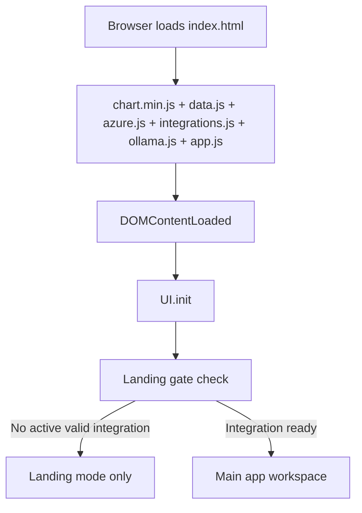
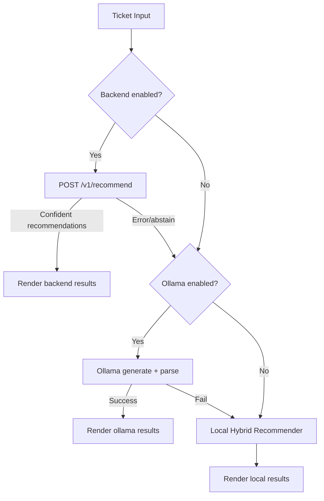

# Recall Full Technical Deep Dive

## 1. Purpose and Scope

This document is a full-system engineering walkthrough of Recall.
It explains:

- every major file and module
- runtime execution order
- recommendation logic (BM25, TF-IDF, signal overlap, confidence/abstain)
- training flows (single ticket + bulk code training)
- embeddings and LLM usage (Ollama)
- Spring backend strategy/fallback/circuit behavior
- storage model and safety constraints

Note on “every line”: the codebase has ~12,631 lines across frontend + backend (+ optional legacy backend workspace files).
This guide is **function-by-function and flow-by-flow** with line references, which is the practical way to explain every executable unit clearly.

## 2. Repository Structure (What each file is for)

### Root frontend/runtime

- `index.html`: main product shell with landing + gated app workspace + settings modal.
- `app.js`: primary frontend runtime controller and local recommendation engine.
- `data.js`: in-memory constants (`PATCH_LIBRARY`, `HISTORICAL_TICKETS`, severity/system enums).
- `azure.js`: Azure DevOps integration service (read-heavy, safe-by-default).
- `integrations.js`: profile manager + provider abstraction (Azure + Jira).
- `ollama.js`: local LLM + embedding integration over Ollama.
- `style.css`: all UI styles (base + many override/theme sections).
- `about.html`, `contact.html`, `contributors.html`: standalone information pages (legacy/static route style).
- `chart.min.js`: local Chart.js bundle (no CDN dependency).

### Java backend (active backend path)

- `spring-backend/src/main/java/...`: Spring Boot app, API, strategy gateways, local recommender.
- `spring-backend/src/test/java/...`: recommender and circuit breaker tests.
- `spring-backend/src/main/resources/application.yml`: backend mode + timeouts + CORS patterns.

### Optional/legacy workspace components (not active tracked backend path)

- `backend/`: Python hybrid recommender workspace (FastAPI/scripts/data pipeline) still present in local workspace.
- `scripts/create_recall_demo_video.py`: artifact generator for demo video/slides.
- `artifacts/demo_video/*`: generated demo assets.

## 3. End-to-End Runtime Execution

### 3.1 Boot sequence (`app.js`)

- `document.addEventListener('DOMContentLoaded', ...)` (`app.js:4124`) is the root startup.
- Calls `UI.init()` (`app.js:1205`) which wires all screens.
- Hydrates trained patches from `TrainingStore` into `PATCH_LIBRARY` (`app.js:4127-4158`).
- Registers modal controls, engine tests, keyboard shortcuts (`app.js:4167-4197`).

### 3.2 Main ticket analysis execution order

When user analyzes a ticket (`_analyzeTicket`, `app.js:2169`) or imports and analyzes (`_fetchAndAnalyze`, `app.js:1984`):

1. Validate/gather ticket payload.
2. Try backend API if enabled (`_runBackendAnalysis`, `app.js:2252`).
3. If backend abstains/fails, try Ollama (`ollama.js` via `OllamaService.recommend`).
4. If Ollama fails or not enabled, fallback to local hybrid engine (`_runTFIDFAnalysis`, `app.js:2299`).
5. Render cards + similar incidents + debug info + feedback controls.

## 4. Frontend Deep Dive

## 4.1 `data.js`

- `PATCH_LIBRARY` starts empty (`data.js:7`) and is populated by training.
- `HISTORICAL_TICKETS` is empty (`data.js:9`), so model quality depends on imported/trained data.
- Severity and DB enums drive UI and normalization (`data.js:12-32`).

## 4.2 `app.js` (core orchestrator)

### 4.2.1 NLP and math primitives (`app.js:11-260`)

- Stopwords + phrase canonicalization + token canonical map.
- `tokenize` pipeline: normalize phrase -> strip chars -> split -> canonicalize -> filter stopwords.
- Implements:
  - lexical overlap score
  - IDF, TF, TF-IDF vector
  - BM25 scoring
  - cosine similarity
- Utility safe localStorage setters/removers.

### 4.2.2 Stores and corpus assembly

- `FeedbackStore` (`app.js:265-339`): per-org feedback boost + ticket history.
- `TrainingStore` (`app.js:344-382`): local training corpus with dedupe by ID/signature.
- `getRecommendationCorpus` (`app.js:384`): merges `HISTORICAL_TICKETS + imported + training`, normalizes, dedupes.
- `RecommendationSettings` (`app.js:403-429`): runtime flags for debug/backend URL/topK.

### 4.2.3 Backend bridge from UI (`BackendRecommendationService`, `app.js:430-640`)

- Builds local corpus payload for backend requests (`_buildLocalCorpus`).
- Calls `/health`, `/v1/recommend`, `/v1/feedback`.
- Re-maps backend `patchId` to local `PATCH_LIBRARY` patch objects.
- Applies local feedback multiplier on top of backend confidence.

### 4.2.4 Local hybrid recommendation engine (`PatchRecommender`, `app.js:646-980`)

#### Candidate scoring

For each corpus ticket:

- Weighted token profile: title x3, desc x2, tags x3, resolution x2, code x2.
- Features:
  - normalized BM25
  - TF-IDF cosine
  - lexical overlap
  - shared high-signal tokens (error-code-like, deadlock/timeout/oom)
- Context multipliers:
  - severity match boost
  - system match boost
  - resolved/source boosts

#### Patch aggregation

- Groups top similar tickets by `resolvedPatch`.
- Computes per-patch support + signal/severity/system evidence + feedback multiplier.
- Computes final score and confidence.
- Produces human-readable reasoning string.
- Applies abstain if evidence is weak or ambiguous.

### 4.2.5 Analytics + charts

- `Analytics` (`app.js:985-1050`): success rates, severity/system distribution, resolution summary.
- `ChartManager` (`app.js:1055-1191`): four chart renderers (usage, severity, systems, success).

### 4.2.6 UI controller (`UI`, `app.js:1196-3922`)

Major responsibilities:

- startup wiring, tabs, forms, stats, charts
- landing-mode gate until integration is valid
- integration profile CRUD/sync actions
- intake analyze paths (manual + fetch-and-analyze)
- results rendering and feedback submission
- history rendering and reload
- training workflows (single + bulk)

Important behaviors:

- Navigation and tab actions are blocked until integration readiness (`_requireIntegrationReady`).
- `Fetch and Analyze` pipeline auto-fills fields from Azure work item, then runs engine fallback chain.
- `Factory Reset` clears all app-owned localStorage keys and runtime state.

### 4.2.7 Training subsystem in `UI`

Single ticket train (`_fetchTrainTicket` + `_addToTraining`):

- Fetches work item.
- Detects linked PRs and prefers completed PR.
- Pulls PR changed files and extracts DB/code content where possible.
- Creates a dynamic trained patch in `PATCH_LIBRARY`.
- Stores aligned training ticket in `TrainingStore`.

Bulk train (`_bulkTrainByCreators`):

- Fetches resolved **Task** work items filtered by creator emails.
- For each task:
  - find completed PR
  - fetch changed code files
  - pull commit content snippets
  - create patch-ticket mapping
- Tracks skip reasons with summarization.
- Purges old non-code training entries before/while retraining.

### 4.2.8 Settings controller (`SettingsModal`, `app.js:3927-4088`)

- Modal mode: `full` vs `onboarding`.
- Saves runtime engine options.
- Tests Ollama and backend connectivity.
- Updates engine indicator.

### 4.2.9 Boot and hydration (`app.js:4124-4197`)

- `UI.init()`
- patch library hydration from saved training
- global object exports for inline handlers
- event listeners for modal + shortcuts.

## 4.3 `ollama.js` (local semantic + LLM reasoning)

### Settings and connectivity

- Persists `enabled/model/embeddingModel/temperature/lastStatus`.
- `checkConnection` probes `GET /api/tags`.

### Embedding flow

- `_embedText` first tries `/api/embed`, then fallback `/api/embeddings` for older Ollama.
- Uses in-memory LRU-like cache (`Map` capped by `_embeddingCacheLimit`).
- Similar incident retrieval:
  - lexical pre-candidates from local recommender
  - embedding cosine rerank
  - top-N similar incidents returned.

### LLM prompt and parsing

- `_buildPrompt` explicitly injects top similar resolved incidents with:
  - ticket title
  - resolution text
  - patch applied
- asks model to return strict JSON array of patch recommendations.
- `_parseRecommendations` strips fences, rescues malformed JSON edges, validates patch IDs, applies feedback boost ordering.

## 4.4 `azure.js` (Azure DevOps service)

Key points:

- Read-only ticket safety default: `READ_ONLY_TICKETS = true`.
- Org/profile storage is sanitized (PAT and secrets are removed from persistent storage).
- Supports:
  - connection test via WIQL
  - bulk fetch work items with optional creator-email filtering
  - single work item fetch with relations/comments
  - PR details/iterations/changes
  - file content fetch at commit
- Work item normalization maps ADO severity/priority into app severity.
- `postComment` exists but blocked unless write mode explicitly enabled.

## 4.5 `integrations.js` (multi-provider profile manager)

Provider abstraction:

- `azure` provider uses `AzureDevOpsService`.
- `jira` provider uses `JiraService`.

Profile and secret handling:

- profile metadata/config in `localStorage`.
- secret/password fields in `sessionStorage` only.
- URL and config validation enforces HTTPS and domain constraints:
  - Azure: `dev.azure.com` or `<org>.visualstudio.com`
  - Jira Cloud: `.atlassian.net`

Sync flow:

- fetch resolved tickets from provider
- normalize to app ticket format
- guess mapped patch via lexical heuristics
- persist imported tickets per profile

## 4.6 `index.html` (DOM contract used by `app.js`)

- Contains both:
  - landing experience (`#org-onboarding-panel`) and
  - full app workspace (`.app-wrapper`).
- App behavior toggles `body.landing-active` to gate access.
- Defines all IDs used by controller for:
  - tabs
  - forms
  - settings modal
  - charts
  - training controls

## 4.7 `style.css` (visual system)

Observations:

- Imports Google Fonts (`JetBrains Mono`, `Plus Jakarta Sans`, `Space Grotesk`).
- Contains base styles plus many later override blocks/themes.
- Final visuals are determined by CSS cascade order, so later declarations override earlier ones.
- Includes dedicated style blocks for:
  - landing page
  - quick settings menu
  - training/code snippet cards
  - info pages
  - responsive breakpoints.

## 5. Spring Backend Deep Dive (`spring-backend`)

## 5.1 API surface

- `GET /health`
- `POST /v1/recommend`
- `POST /v1/feedback`
- `POST /v1/reload`

`RecommenderController` is a thin delegator to `RecommenderService`.

## 5.2 Strategy + fallback architecture

- `RecommendationGateway` interface.
- `LocalRecommendationGateway` delegates to `LocalFallbackRecommender`.
- `ProxyRecommendationGateway` delegates to `LegacyBackendClient`.
- `RecommenderService` chooses behavior by mode + circuit + fallback flag.

Modes:

- `LOCAL`: always local recommender.
- `PROXY`: try legacy backend first, fallback to local on failure if enabled.

## 5.3 Circuit breaker (`LegacyCircuitBreaker`)

- Tracks consecutive proxy failures.
- Opens circuit once threshold is reached.
- Blocks requests until cooldown elapses.
- Success resets failure count and closes circuit.

## 5.4 Local recommender algorithm (`LocalFallbackRecommender`)

This is the main backend recommendation implementation.

### Inputs

- `query` ticket
- patch library list
- local corpus (resolved incidents)

### Pipeline

1. Build incident docs from local corpus.
2. Tokenize weighted text representation.
3. Build TF, DF, IDF, TF-IDF vectors.
4. Compute per-doc features:
   - BM25
   - cosine
   - lexical overlap
   - structured signal overlap (error codes, engine, exception)
5. Normalize and combine lexical + signal + RRF.
6. Select top matches using dynamic floor.
7. Group by `resolvedPatch` and compute patch-level scores.
8. Apply feedback multiplier.
9. Compute confidence and reasoning/evidence.
10. Apply abstain logic on weak/ambiguous evidence.

### Structured signals extracted

- error codes (`error/msg/code NNN...`)
- SQL states (5-digit)
- detected exception class (deadlock/timeout/oom/corruption/login/replication/throttle)
- normalized DB engine
- severity

### Confidence + abstain

Abstains when:

- no recommendations
- top score/confidence/evidence is weak
- top two candidates are too close and low-confidence

## 5.5 Supporting backend classes

- `BackendProperties`: typed config (mode/timeouts/circuit/CORS origins).
- `RestClientConfig`: request/read timeout wiring for `RestTemplate`.
- `CorsConfig`: allowed origin patterns from config.
- `ApiExceptionHandler`: central validation/runtime error payload formatting.
- model classes: request/response payload DTOs.

## 6. Recommendation and Training Algorithms (Detailed)

### 6.1 Local frontend ranking formula (conceptual)

For candidate ticket `d` and query `q`:

- `base = 0.50*bm25_norm + 0.34*cosine + 0.16*overlap`
- multiply by shared-signal boost
- multiply by severity/system context boosts
- patch-level final score multiplies support/signal/feedback boosts

Confidence is then derived from weighted evidence and clipped to range.

### 6.2 Backend local ranking formula (conceptual)

Doc score combines:

- normalized lexical score
- signal score
- RRF score

Patch score combines:

- avg similarity
- support boost
- signal/severity/system/error boosts
- feedback multiplier

### 6.3 Embeddings path

Active in frontend Ollama flow:

- query embedding and candidate incident embeddings via Ollama embedding model (`nomic-embed-text` default)
- cosine similarity for semantic rerank
- top similar incidents injected into generation prompt

### 6.4 Training data evolution

- Initial seed data removed (`PATCH_LIBRARY`/`HISTORICAL_TICKETS` empty in `data.js`).
- Quality depends on:
  - imported resolved incidents
  - manually/bulk trained code-linked incidents
  - feedback votes.

## 7. Storage Model and Data Keys

### `localStorage`

- `azpatch_training_corpus`
- `az_recommendation_settings`
- `az_ollama_settings`
- `azpatch_ticket_integrations`
- `azpatch_ticket_active_profile`
- `azpatch_ticket_imported_<profileId>`
- `azpatch_org_<namespace>_feedback`
- `azpatch_org_<namespace>_history`
- additional per-org integration caches from `azure.js`

### `sessionStorage` (secrets)

- `azpatch_ticket_secret_<profileId>_<field>` for PAT/API token/password fields.

## 8. Safety and Reliability Design

- Integration/credential validation before remote calls.
- Read-only Azure mode default (`READ_ONLY_TICKETS=true`).
- Secrets do not persist across browser restart.
- Multi-engine fallback chain prevents hard downtime.
- Circuit breaker prevents repeated proxy failures.
- Abstain behavior prevents overconfident wrong suggestions.

## 9. Test Coverage Snapshot

- `LocalFallbackRecommenderTest`
  - verifies correct patch is preferred on similar evidence.
  - verifies abstain when no mapped patch evidence exists.
- `RecommenderServiceTest`
  - verifies proxy failure fallback behavior.
  - verifies circuit-open + fallback-disabled throws.
- `LegacyCircuitBreakerTest`
  - verifies open/close state transitions.

## 10. Optional Legacy Python Workspace (present locally)

`backend/` still contains a full Python hybrid recommender workspace:

- FastAPI service
- retrieval/signals/embedding modules
- data scripts for ADO fetch, signal extraction, embedding build, split/eval/rerank

Current product direction in this repo is Java backend (`spring-backend`) + frontend.
Python workspace remains useful as reference tooling and demo artifact generator input.

## 11. Execution Flow Reference by User Journey

### Landing and onboarding

1. Open app.
2. If no active valid integration profile, landing mode stays enabled.
3. `Integrate Organization` opens onboarding modal mode.
4. Save and activate profile unlocks workspace.

### Incident resolution flow

1. Intake manually or fetch from Azure by work item ID/URL.
2. Run recommendation pipeline (backend -> ollama -> local).
3. Show ranked patches + evidence.
4. Mark resolved / feedback to improve ranking.

### Training flow

1. Fetch resolved ticket + PR context.
2. Build trained patch (prefer code snippets where available).
3. Add ticket-to-patch mapping into corpus.
4. Bulk mode repeats same logic for creator-email filtered task set.

## 12. Reading Order Recommendation

If someone needs to understand the code quickly in the best order:

1. `index.html` (DOM contract).
2. `data.js` (seed/corpus assumptions).
3. `app.js` sections 1-4 (tokenization + local recommender + backend bridge).
4. `app.js` UI section for runtime behavior and gating.
5. `azure.js` and `integrations.js` for data ingress and profile security.
6. `ollama.js` for semantic/LLM path.
7. `spring-backend/service/RecommenderService` and `LocalFallbackRecommender` for backend algorithm details.

This sequence gives complete mental model with minimum context switching.
